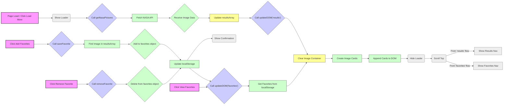

# Architecture

This document outlines the architecture of the Awesome NASA APOD Viewer project.

## 1. Overview

The Awesome NASA APOD Viewer is a simple, client-side web application. It leverages HTML for structure, CSS for styling, and vanilla JavaScript for dynamic behavior and interaction with the NASA APOD API. There is no backend component; all logic runs within the user's browser, and state (user favorites) is stored using the browser's `localStorage`.

## 2. Folder Structure

The project uses a flat directory structure, containing the essential files for a basic web application:

```
nasa-apod/
│
├── index.html       # Main HTML file (structure, layout)
├── script.js        # JavaScript file (application logic, API interaction)
└── style.css        # CSS file (styling, layout, responsiveness)
```

- **`index.html`**: Defines the basic page structure, including containers for the loader, navigation, image display area, and the save confirmation message. It links to the `style.css` and `script.js` files.
- **`style.css`**: Contains all styling rules for the application, including layout (using flexbox), card design, navigation bar appearance, loader animation styling, and basic media queries for responsiveness.
- **`script.js`**: Holds the core application logic. It handles fetching data from the NASA APOD API, dynamically creating and updating the DOM to display images and details, managing the "results" vs "favorites" views, handling user interactions (clicking "Load More", "Add To Favorites", "Remove Favorite"), and interacting with `localStorage` to persist favorites.

## 3. Major Components

- **HTML (`index.html`)**:
  - **Loader:** A `div` with class `loader` that covers the screen initially or while data is fetching.
  - **Navigation:** A container (`navigation-container`) with two modes (`resultsNav`, `favoritesNav`) toggled via JavaScript. Includes links to trigger actions like loading more images or switching views.
  - **Image Container:** A `div` with class `images-container` where image cards are dynamically inserted by JavaScript.
  - **Save Confirmation:** A `div` with class `save-confirmed` shown temporarily when a user favorites an image.
- **CSS (`style.css`)**:
  - **Layout:** Primarily uses Flexbox for centering content and basic structure.
  - **Card Styling:** Defines the appearance of the image cards (`.card`, `.card-body`, `.card-img-top`).
  - **Fixed Elements:** Uses `position: fixed` for the loader and navigation bar to keep them in place during scrolling.
  - **Responsiveness:** Includes a simple media query (`@media screen and (max-width: 800px)`) to adjust layout on smaller screens.
  - **Utility Classes:** `.hidden` to toggle element visibility, `.clickable` for interactive text elements.
- **JavaScript (`script.js`)**:
  - **Global Variables:** References to key DOM elements, API constants (`apiUrl`, `apiKey`, `count`), and state variables (`resultsArray`, `favorites`).
  - **`getNasaPictures()`:** Asynchronous function to fetch data from the NASA API using `fetch`. Handles showing/hiding the loader.
  - **`createDOMNodes(page)`:** Generates HTML elements (cards) for each image result or favorite based on the current page context ('results' or 'favorites').
  - **`updateDOM(page)`:** Manages the overall view update process. It retrieves favorites from `localStorage`, clears the existing image container, calls `createDOMNodes` to build the new view, and updates the navigation visibility using `showContent`.
  - **`saveFavorite(itemUrl)`:** Adds an image object to the `favorites` dictionary and updates `localStorage`. Shows a confirmation message.
  - **`removeFavorite(itemUrl)`:** Removes an image object from the `favorites` dictionary, updates `localStorage`, and refreshes the favorites view via `updateDOM`.
  - **`showContent(page)`:** Handles UI state changes like scrolling to the top, hiding the loader, and toggling navigation visibility based on the current view ('results' or 'favorites').
  - **Event Handling:** Uses `onclick` attributes in the HTML (e.g., `onclick="getNasaPictures()"`) to trigger JavaScript functions.
  - **Initialization:** Calls `getNasaPictures()` on script load to fetch initial data.

## 4. Data Flow

The application follows these primary data flows:

1.  **Initial Load / Load More:**

    - User Action: Page loads OR Clicks "Load More".
    - `getNasaPictures()` is called.
    - Loader is shown.
    - `fetch(apiUrl)` requests data from NASA APOD API.
    - API responds with JSON data (array of image objects).
    - Response data stored in `resultsArray`.
    - `updateDOM('results')` is called.
    - `imagesContainer` is cleared.
    - `createDOMNodes('results')` iterates `resultsArray`, creates HTML cards, appends to `imagesContainer`.
    - `showContent('results')` hides loader, scrolls top, shows results navigation.

2.  **Add to Favorites:**

    - User Action: Clicks "Add To Favorites".
    - `saveFavorite(itemUrl)` is called with the image URL.
    - Function iterates `resultsArray` to find the matching image object.
    - If found and not already a favorite, the object is added to the `favorites` object (using URL as key).
    - `localStorage.setItem('nasaFavorites', JSON.stringify(favorites))` updates persistent storage.
    - Save confirmation message is shown briefly.

3.  **View Favorites:**

    - User Action: Clicks "Favorites" Navigation Link.
    - `updateDOM('favorites')` is called.
    - `favorites` object is populated from `localStorage.getItem('nasaFavorites')`.
    - `imagesContainer` is cleared.
    - `createDOMNodes('favorites')` iterates `Object.values(favorites)`, creates HTML cards, appends to `imagesContainer`.
    - `showContent('favorites')` hides loader, scrolls top, shows favorites navigation.

4.  **Remove Favorite:**
    - User Action: Clicks "Remove Favorite" (in favorites view).
    - `removeFavorite(itemUrl)` is called with the image URL.
    - Item is deleted from the `favorites` object: `delete favorites[itemUrl]`.
    - `localStorage.setItem('nasaFavorites', JSON.stringify(favorites))` updates persistent storage.
    - `updateDOM('favorites')` is called to refresh the favorites view (which re-runs steps from "View Favorites").




## 5. Design Decisions

- **Vanilla JavaScript:** Chosen for simplicity and to avoid the overhead of frameworks for a project of this small scale. It demonstrates core web development concepts.
- **`localStorage` for Favorites:** Provides easy client-side persistence without requiring a backend or database. The trade-off is that data is tied to the specific browser and can be lost if the user clears their data.
- **NASA `DEMO_KEY`:** Used by default for ease of setup and demonstration, acknowledging its rate limitations. Users are advised to obtain their own key for extended use.
- **`fetch` API:** Modern standard for making asynchronous network requests in JavaScript. `async/await` syntax is used for cleaner asynchronous code.
- **Dynamic DOM Manipulation:** Content is loaded dynamically. Instead of having static elements for each potential image, JavaScript creates card elements on the fly based on the API response or `localStorage` data. This is efficient for handling variable amounts of data.
- **Flat Structure:** Sufficient for a small project. For larger applications, organizing CSS and JS into multiple files/folders (e.g., modules, components) would be necessary.
- **`loading="lazy"` attribute:** A simple browser-native way to defer the loading of off-screen images, potentially improving initial page load time.
- **Separate View Logic (`updateDOM`, `showContent`):** Functions manage the transitions between showing API results and showing saved favorites, keeping the UI state consistent.
